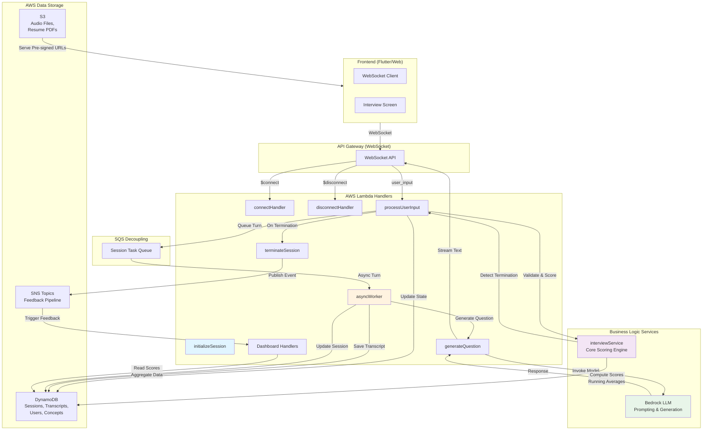

# Qlue Interview Platform Architecture

## System Overview

Qlue is a multi-module AI-powered interview preparation platform built on AWS serverless infrastructure. The system uses asynchronous processing, WebSocket-based real-time communication, and adaptive difficulty scoring to deliver a personalized interview experience.

---

## Core Architecture Diagram



---

## Key Architectural Patterns

### 1. **Asynchronous Turn Processing (SQS Decoupling)**

```
User Input (WebSocket) 
  ↓
processUserInput (validates, scores locally, queues turn)
  ↓
SQS Queue (decouple frontend-blocking operations)
  ↓
asyncWorker (generates AI response, streams back via WebSocket)
  ↓
Session updated in DynamoDB
```

**Why:** Prevents LLM latency from blocking WebSocket connections. Users see streaming text feedback in real-time while heavy Bedrock operations complete asynchronously.

---

### 2. **Adaptive Difficulty Scoring Pipeline**

```
User responds
  ↓
buildScoringPrompt() invokes Bedrock
  ↓
LLM returns JSON scores on module-specific dimensions
  ↓
interviewService: Compute Running Averages
  (newAvg = prevAvg + (newScore - prevAvg) / turnNumber)
  ↓
Session.accumulatedScores updated in DynamoDB
  ↓
Next call to generateQuestion:
    - Injects accumulatedScores into prompt
    - LLM reads <difficulty_adjustment> block
    - Question complexity scales based on performance
```

**Performance-Based Difficulty Levels:**
- **High performers (≥80):** Advanced technical questions, edge cases, nuanced scenarios
- **Moderate performers (60-79):** Balanced difficulty, test intermediate knowledge
- **Struggling candidates (<60):** Foundational questions, build confidence

---

### 3. **SNS Feedback Pipeline**

```
User completes session
  ↓
terminateSession handler
  ↓
Publishes to SNS topic: session:completed
  ↓
Triggers Lambda: analyzeTranscript
  ↓
Generates feedback report using Bedrock
  ↓
storeFeedbackReport updates session.accumulatedScores
  ↓
Frontend fetches report via getSessionFeedback
```

---

### 4. **State Machine: Interview Turn Flow**

```
INITIALIZING
  ↓ (WebSocket connect)
LOADING_CONTEXT (fetch resume, website, user data)
  ↓ (AI response ready)
AI_SPEAKING (stream audio/text to frontend)
  ↓ (user speaks)
USER_RESPONDING (recording captured)
  ↓ (speech to text)
PROCESSING_RESPONSE (score user input)
  ↓ (if excellent performance or more turns needed)
GENERATING_FEEDBACK (next AI question via asyncWorker)
  ↓ (loop back to AI_SPEAKING)
  ↓ (or after max turns / silence threshold)
TERMINATED
```

---

## Module-Specific Flows

### **RESUME Module** (Technical Interviewing)
- Scoring dimensions: clarity, fluency, technicalVocabulary, useOfExamples
- Context: Candidate's resume parsed data, professional background
- Adaptive difficulty adjusts question depth based on technical clarity scores

### **HR Module** (Behavioral Interviewing)
- Scoring dimensions: teamwork, ethicalThinking, problemSolving, communicationClarity, selfAwareness
- Context: Candidate's name, current role
- Adaptive difficulty: Nuance/complexity of behavioral scenarios

### **WEBSITE Module** (Learning/Teaching)
- Scoring dimensions: comprehensionAccuracy, learningProgression, criticalThinking, responseClarity, conceptRetention
- Context: Scraped website content, target concept
- Concept mastery tracking: Score ≥70 → marks concept MASTERED
- Adaptive difficulty: Progresses through related concepts based on comprehension

### **INTRO Module** (Self-Introduction Coaching)
- Scoring dimensions: clarity, structure, confidence, relevance
- Context: None (coaching-only)
- Adaptive difficulty: Progresses from basic framing → strategic positioning → polish

---

## Data Flow: Session Lifecycle

```
1. initializeSession
   - Creates DynamoDB session record
   - Initializes accumulatedScores: {}
   - Returns WebSocket URL + sessionId
   
2. connectHandler
   - Registers connectionId in connections table
   
3. asyncWorker (Turn Loop)
   Per turn:
   a) Fetch session.accumulatedScores
   b) Generate question with difficulty context
   c) Save question to transcript
   d) Stream audio/text to user
   e) Update session.turnCount, session.updatedAt
   
4. interviewService.processUserTurn (On user input)
   a) Compute dimension scores via Bedrock
   b) Update running averages in accumulatedScores
   c) Check termination conditions:
      - Silence retries ≥ 3
      - Turns > 20
      - Session age > 15 minutes
   d) Return nextAIResponse or TERMINATED signal
   
5. terminateSession
   - Mark session.activeMarker = null
   - Publish SNS event
   - Trigger feedback generation
   
6. Dashboard handlers (Post-session)
   - Read accumulatedScores for module stats
   - Aggregate across all sessions for trends
   - Return radar data, best scores, progress graphs
```

---

## Infrastructure as Code (SAM Template)

Key resources deployed via `backend/template.yaml`:

- **Lambda Functions:** All handlers (initializeSession, asyncWorker, etc.)
- **DynamoDB Tables:**
  - `qlue-sessions`: Session state, scores, transcripts linked
  - `qlue-users`: User profiles, preferences
  - `qlue-resumes`: Resume data, parsing metadata
  - `qlue-concepts`: Learning concepts for WEBSITE module
  - `qlue-feedback`: Feedback reports (optional separate table)
- **API Gateway:** WebSocket API for real-time communication
- **SQS Queue:** Session task decoupling
- **SNS Topics:** Feedback pipeline events
- **S3 Bucket:** Audio file storage, pre-signed URLs
- **IAM Roles:** Lambda execution permissions

---

## Security & Access Control

### **User Ownership Verification**
```javascript
// Every handler verifies ownership before returning data
if (session.userId !== requestContext.authorizer.uid) {
  return 403 Forbidden;
}
```

### **Concurrency Lock**
```javascript
// Prevents duplicate/overlapping sessions
const activeSession = await getActiveSessionForUser(userId);
if (activeSession && !body.force) {
  return 409 ConcurrentSessionError;
}
```

### **Secrets Management**
- Bedrock Model ID can be stored in AWS Secrets Manager
- Fallback to environment variables or hardcoded defaults
- Token usage logging sanitized before telemetry

---

## Performance Optimizations

1. **Connection Pooling:** DynamoDB client auto-manages connection pools
2. **Pagination:** Dashboard queries use query limits to prevent large table scans
3. **Caching:** Session data fetched once per turn, reused for scoring
4. **Streaming:** Bedrock responses streamed token-by-token to reduce perceived latency
5. **Async Processing:** SQS decouples WebSocket handlers from LLM latency
6. **TTL Cleanup:** Session records auto-expire after inactivity (zombie cleanup)

---

## Monitoring & Observability

### **Structured Logging**
```javascript
logger.info('BedrockTokenUsage', {
  modelId: 'us.amazon.nemotron-4-340b-instruct-v1-0',
  inputTokens: 342,
  outputTokens: 128,
  totalTokens: 470,
  latencyMs: 2340
});
```

CloudWatch Logs Insights queries:
- Cost analytics per session
- Latency percentiles
- Error rate by handler
- Token efficiency

### **Metrics to Monitor**
- Session completion rate
- Average turn count per module
- LLM latency (p50, p99)
- Token cost per session
- Session error rate
- Concurrent active sessions

---

## Future Enhancements

1. **Cost Analytics Dashboard:** Query structured token logs to show per-session spend
2. **Benchmark Comparisons:** Track user progress against population averages
3. **Interview Analytics:** Provide recruiters with candidate scoring insights
4. **Advanced Concepts:** Multi-module learning paths with prerequisite tracking
5. **Human-in-the-Loop:** Allow recruiters to review/override feedback scores

---

## Deployment

```bash
# Build and deploy
sam build
sam deploy \
  --stack-name qlue-backend \
  --capabilities CAPABILITY_IAM \
  --parameter-overrides \
    BedrockModelId=us.amazon.nemotron-4-340b-instruct-v1-0 \
    AudioBucket=qlue-audio-prod \
    SessionsTable=qlue-sessions
```

---

**Architecture Owner:** Backend Team  
**Last Updated:** May 2026  
**Version:** 1.0 (Post-Adaptive Difficulty Implementation)
